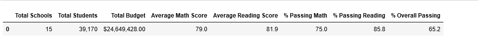
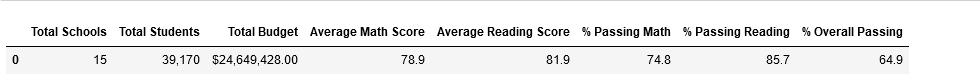

# School District Analysis
## Overview of the Project
Maria has asked us on behalf of the school board to reevaluate the ninth grade data from Thomas High School. First, we were able to seperate the ninth gradeers math and reading scores from our DataFrame and set their values to NaN. From there, we were able to run our initial analysis again with updated numbers for Thomas High School. 
## Results
Following our second analysis, we were able to see some changes in the school data summaries:
* As shown in the tables below, removing the scores from Thomas High School resulted in slightly lower percentage rates of passing students accross math and reading combined. 
   * 
   * 
 * 
