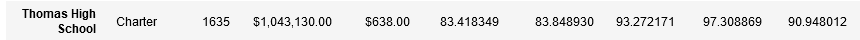
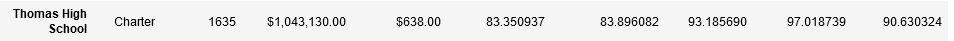

# School District Analysis
## Overview of the Project
Maria has asked us on behalf of the school board to reevaluate the ninth grade data from Thomas High School. First, we were able to seperate the ninth gradeers math and reading scores from our DataFrame and set their values to NaN. From there, we were able to run our initial analysis again with updated numbers for Thomas High School. 
## Results
Following our second analysis, we were able to see some changes in the school data summaries:
* As shown in the tables below, removing the scores from Thomas High School resulted in slightly lower percentage rates of passing students in the district accross math and reading combined. 
   * Initial District Analysis:
   
   * Updated District Analysis:
   
 * Similarly, the Thomas High School percentages also decreased when the ninth grade data was removed.
    * Initial School Analysis:
    
    * Updated School Analysis:
    
* However, these percentage decreases in math and reading scores did not effect how Thomas High School is ranked when compared to other schools in the district, as Thomas High School is ranked second in both the initial and updated analysis. 
* Furthermore, for each of the following comparisons, removing the ninth grade scores at Thomas High School made no significant impact when rounded to the nearest percent:
  * Math and reading scores by grade
  * Scores by school spending
  * Scores by school size
  * Scores by school type
## Summary
Upon review of our analysis, it is clear that removing the altered grades from the ninth grade class at Thomas High School did not alter the results of our initial analysis. Though the passing percentages for Thomas High School and the school district as a whole did fall, the amount decreased was too insignificant to change the outcome of our analysis. 
